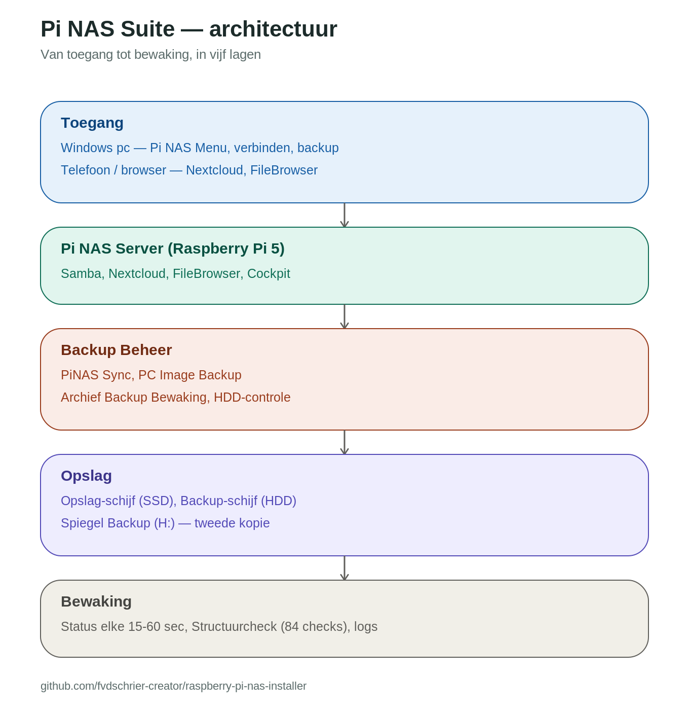

# Pi NAS Suite

Een complete thuisserver-oplossing op basis van een Raspberry Pi 5 - bestanden opslaan,
automatisch backuppen, en volledig beheren vanuit Windows, zonder technische kennis.

**[Bekijk de presentatie](Publicatie/PiNAS_Suite_Presentatie_Preview.pdf)** - een uitgebreide
walkthrough met screenshots van installatie tot dagelijks gebruik (PDF, direct
leesbaar in de browser). Origineel (bewerkbaar): [PiNAS_Suite_Presentatie.pptx](Publicatie/PiNAS_Suite_Presentatie.pptx).

**[Volledige handleiding](Publicatie/PiNAS_Suite_Handleiding.pdf)** - alle vensters,
knoppen en instellingen in detail.

## Wat is dit?

De suite bestaat uit drie delen die samenwerken:

| Onderdeel | Wat doet het? | Op welk apparaat? |
|---|---|---|
| Pi NAS Menu | Verbinden, uploaden, diagnose, beheer | Windows PC |
| PiNAS Sync | Synchroniseren en PC Images backuppen | Windows PC |
| Pi NAS Server | Bestanden opslaan, Nextcloud, FileBrowser, Cockpit | Raspberry Pi 5 |

Onderdelen: Samba (netwerkschijven), Nextcloud (eigen cloud), FileBrowser (webbeheer),
Cockpit (Pi-beheer via browser), en optionele add-ons (Pi-hole, ZeroTier, Vaultwarden,
printserver, statuspagina, dashboard).

## Snel starten - van 0 naar werkend

1. **Bron kiezen**: pak deze repository uit (of download als ZIP)
2. **Beheer_install.bat draaien** (staat los in de root) - zet de hele suite neer op
   `C:\PiNAS`, installeert de Windows-onderdelen en maakt een bureaubladsnelkoppeling.
   Dit bestand opent zelf niets - open daarna zelf de nieuwe snelkoppeling.
3. **Pi NAS Menu -> Installatie & Herstel** - de wizard (4 stappen: Gegevens, SD-kaart,
   Pi instellen, Windows klaarzetten) doet de rest automatisch.

Zie de `Installatie/`-map: die bevat een LEESMIJ met downloadlinks voor de installers
die je zelf even moet ophalen (Docker, PuTTY, TigerVNC, Python, Raspberry Pi Imager -
te groot om in deze repository mee te nemen).

Volledige uitleg, inclusief een beslisboom voor "wat als ik al iets heb staan":
zie de [handleiding](Publicatie/PiNAS_Suite_Handleiding.pdf), hoofdstuk 2.

## Mapstructuur

| Map | Inhoud |
|---|---|
| `Beheer/` | Pi NAS Menu, installer, Backup Beheer |
| `Sync/` | PiNAS Sync (synchronisatieprogramma) |
| `ArchiefBackup/` | Archief Backup Bewaking |
| `Addons/` | Nextcloud, Pi-hole, ZeroTier, Vaultwarden en meer |
| `PiServer/` | Server-scripts die op de Pi zelf draaien |
| `Gedeeld/` | Gedeelde hulpmodules |
| `Publicatie/` | Handleiding en presentatie |
| `Installatie/` | LEESMIJ + downloadlinks voor installers |

## Bekende beperkingen & roadmap

Dit is een solo-onderhouden project - vooral gericht op functionaliteit en
documentatie. Een paar dingen om te weten voordat je begint:

- De Windows-installatiekant draait nu op .bat-scripts; migratie naar Python
  staat op de planning voor meer robuustheid.
- Nog geen geautomatiseerde CI-pipeline - tests draaien lokaal via
  `test_suite.py`, niet automatisch bij elke commit.
- "Op mijn iPhone" (de Bestanden-app) is niet doorbladerbaar via de
  iPhone-functies - een vaste iOS/libimobiledevice-beperking, geen bug
  (zie hoofdstuk over iPhone Back-up in de handleiding).
- Issues en bijdragen zijn welkom, maar dit is een nevenproject - reactietijd
  kan wisselen.

## Licentie

MIT License - vrij te gebruiken, aanpassen en verspreiden. Vermeld de oorsprong als je
het deelt.
